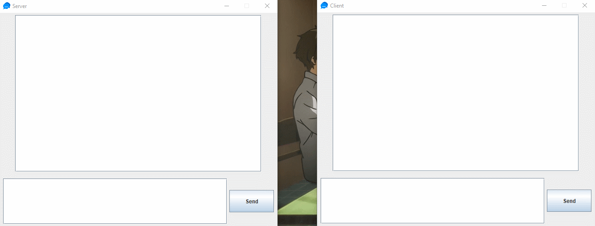

<h1 align="center">Chat 💬</h1>

## Description
Hi, I developed a simple chat in java with swing and socket library.
Software start server and client, send receive messages exchanged for the client and server.

## How To Use

````
# Clone Git Repository
git clone https://github.com/YoruHinda/Chat.git
````

````
# Enter Directory
cd chat
````

````
# Run First ChatServer.jar then Run ChatClient.jar
java -jar chatserver.jar
java -jar chatclient.jar
````